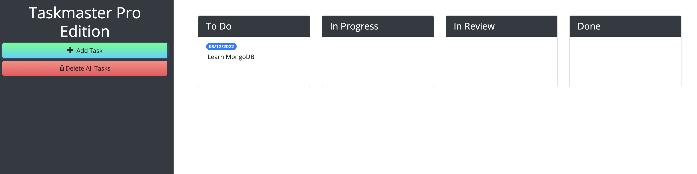

# TaskMaster Pro

## Table of Contents

- [Description](#description)
- [Usage](#usage)
- [Application](#application)
- [Questions](#questions)

## Description

Taskmaster is a task-management application created by following the steps of a course module on jQuery, and Bootstrap.

## Usage

Open website and add task with green “Add Task” button. Move the task between the marked columns that represent task status. Drag the task to the bottom of the window to delete task.

## Application

[Link to Deployed Application](https://gilinamcbride.github.io/taskmaster-pro/)

## Questions?

For any questions, please email gilinamcbride@gmail.com, or visit any other projects on [Github](github.com/gilinamcbride).
